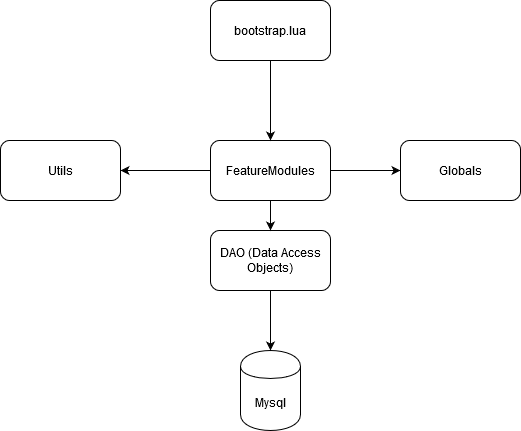

# gothic-multiplayer-adventures-server
Servercode für den Gothic Multiplayer Adventures Server

# GMA

Dieses Projekt enthält den Servercode für den Gothic Multiplayer Adventure Server. Das Repository soll dazu dienen Interessierten zu zeigen wie die Features umgesetzt wurden. Um den Server aufzusetzen braucht ihr allerdings noch den Gothic Multiplayer Server, die GMA.mod und den Gothic Multiplayer Client. Da diese Dateien sehr groß sind, werde ich Sie hier aber nicht hochladen. Der Gothic Multiplayer Server und Client sollten in der Community im Umlauf sein. Die GMA.mod enthält veränderte Waffen, Rüstungen und eine veränderte .ZEN. 
Ihr braucht die GMA.mod also nicht zwangsläufig wenn ihr z.B die Waffen nicht mitverwenden wollt. 
Skripte die neue Waffen/Rüstungs-Instanznamen verwenden sind z.B "class_globals.lua", oder "price_table.lua". Diese müsst ihr gegebenenfalls anpassen. Jeder der daran interessiert ist, kann mir bei Bedarf auch eine Nachricht an: "lucy.johnson.99.08.18@gmail.com" schicken. 

Den Code allerdings könnt ihr euch clonen, verändern und verteilen wie ihr wollt. Es ist sogar erwünscht, dass jemand anderes den Code als Grundlage für einen eigenen Server verwendet. 

## Ordner:
Das Projekt beginnt mit 5 Ordnern. Im folgenden werden die Inhalte genauer beschrieben.

### filterscripts: 
Enthält lediglich ein Skript, dass ich zum debuggen verwendet habe.

### gamemodes:
Hier ist die "bootstrap.lua" enthalten. Dies ist der Einstiegspunkt des Servers. Von hier wird der gesamte Server-Code aufgerufen.

### scripts: 
Hier sind sämtliche Skripte für die Monster-KI enthalten. Der Code wurde hauptsächlich von Mainclain geschrieben und ich habe hier lediglich ein paar NPC's hinzugefügt.

### serverscripts: 
Hier sind sämtliche von mir geschriebenen Serverskripte gelagert welche die Features des Servers umfassen. Genaueres beschreibe ich in der Macro-Architektur, die ihr euch durchlesen solltet um den workflow mit dem Code zu verstehen.

### sqlscripts: 
Hier sind sämtliche SQL-Skripts enthalten mit welcher ihr das Datenbankmodell anlegen könnt.

## Macro-Architektur:

Die Macro-Architektur sieht folgendermaßen aus.

Ganz oben seht ihr den Einstiegspunkt "bootstrap.lua". Von dort aus werden die Aufrufe zum Code "feature modules" getätigt. Bei den "feature modules" handelt es sich um Unterordner welche die Skripte für einzelne Features enthalten.

*Wichtig:* Die Idee hierbei ist, dass "feature modules" sich untereinander NICHT aufrufen. Das sorgt dafür, dass man Features schnell rein und raus slotten kann und soll diesbezüglich eine Veränderbarkeit der Codebasis ermöglichen.

"feature modules" können aber jeden anderen Code aufrufen der nicht in anderen "feature modules" steckt wie z.B "utils", "globals" oder "DAO's (data access objects)". "feature modules" können auch Code innerhalb des eigenen "feature module" Ordners aufrufen.

Die DAO's spielen eine besondere Rolle, weil sie mit der Datenbank kommunizieren. Hier finden die gesamten Queries statt. DAO's sollen eine Schicht zwischen der Datenbank und dem Feature-Code bilden um Verantwortlichkeiten voneinander zu trennen und damit eine losere Koppelung zu ermöglichen (was wiederum die Wartbarkeit und Wandelbarkeit des Codes verbessert).

## Bisheriger workflow:

Wenn ihr ein neues Feature implementieren wollt, dann fangt ihr am Besten damit an im "feature_modules" Ordner einen neuen Subordner für das Feature anzulegen, dass ihr programmieren wollt. 

Ich verwende dabei Lua's "module Syntax" (am Besten schaut ihr euch dazu den Code mal an) um die Funktionalitäten zu kapseln. Am Ende expose ich eine einzige table mit allen Funktionen und Variablen für das "feature module" drin.

Diese table wird dann in der "bootstrap.lua" eingefügt und in die entsprechenden Gothic-Multiplayer Callbacks integriert.

## Sonstiges:

Ich weiß nicht wie lange ich noch aktiv sein werde in der Gothic-Multiplayer-Community. Deshalb möchte ich mich im vorraus entschuldigen, wenn keine Antwort von mir mehr zurückkommt. Die Leute die wissen wie man einen Multiplayer Server programmiert sollten in der Lage sein mit dem Code arbeiten zu können, wobei die meisten Features wahrscheinlich nichts innovatives sind und schon vielfach bereits implementiert wurden. Für die Anderen empfehle ich erstmal selbst einige Skripte zu schreiben um ein Gefühl für die Gothic Server Programmierung zu bekommen. 

## License
[MIT](https://choosealicense.com/licenses/mit/)

